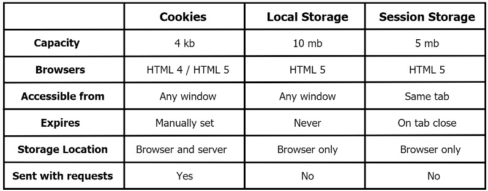

# **Writing Test Week 2-Back End Bootcamp**
## **Database**
___

> **Database** adalah tempat untuk menyimpan data/koleksi yang terstruktur, dimana didalamnya terdapat informasi-informasi atau data-data yang bersifat elektronik.

- Cara mengakses database biasanya menggunakan aplikasi yang bernama **DBMS (Database Management System)**
- Database yang akan digunakan dan dipelajari yaitu berbasis **SQL (Structured Query Language)**

Ada berbagai macam aplikasi untuk membuat database berbasis SQL, yaitu :
- MySql
- MariaDB
- PostgreSql
- Oracle

Beberapa istilah di database :
- **Table** adalah kumpulan value yang dibangun oleh baris dan kolom, yang didalamnya berisikan atribut dari sebuah data.
- **Field/Attribute** adalah kolom dari sebuah tabel dimana masing-masing field memiliki tipe data masing-masing.
- **Record** merupakan kumpulan nilai yang saling terkait. Record merupakan isi dari sebuah tabel.


## **MySql**
___

> **MySql** ialah DBMS yang *Open Source* dan kompatible untuk banyak platform.

- Port yang biasa digunakan di Mysql yaitu `3306`

- Saat menggunakan MySql yang dibutuhkan adalah Mysql Server, bisa menggunakan salah satu di bawah ini :
    - CLI
    - Workbench
    - DBeaver
    - TablePlus
    - Phpmyadmin

Cara mengakses database Mysql menggunakan CLI :
```
mysql -u root -p // lalu masukkan password
mysql -u root // jika tidak menggunakan password
```

Cara menampilkan list database :
```
show databases;
```

Cara mengakses salah satu dari list database :
```
use nama_database;
```

**Berikut beberapa Data Type di SQL :**
- Number
    - `int` -> Tipe data untuk angka bulat
    - `float` -> Tipe data untuk angka menggunakan koma
    - `decimal` -> Tipe data angka pecahan (desimal), dimana jumlah angka pecahan (angka di belakang koma) sudah di tentukan dari awal.

- String
    - `char` -> Tipe data string dengan fixed length dan memori sesuai panjang yang didefinisikan
    - `varchar` -> Tipe data string dengan penyimpanan karakter yang fleksibel max 255
    - `text` -> Tipe data string dengan penyimpanan yang lebih panjang dari varchar 
    - `enum` -> Tipe data yang khusus untuk kolom dimana nilai datanya sudah kita tentukan sebelumnya. 

- Date Time
    - `date` -> Tipe data untuk menyimpan tanggal ('CCYY-MM-DD')
    - `datetime` -> Tipe data untuk menyimpan tanggal dan waktu ('CCYY-MM-DD hh:mm:ss')
    - `time` -> Tipe data untuk menyimpan waktu (‘hh:mm:ss’)
    - `timestamp` -> Time data untuk menyimpan tanggal dan waktu dan juga UTC nya atau timezone (CCYY-MM-DD hh:mm:ss +00:00')
- `boolean` -> Tipe ini hanya menyimpan 2 tipe data yaitu TRUE dan FALSE, dan dapat di convert menjadi int dengan representasi TRUE = 1, dan FALSE = 0
- `DEFAULT` -> Tipe data untuk set default value jika tidak di assign dengan value
- `NULL` -> Tipe data kosong atau tipe data yang belum di assign dengan value / data

**Berikut Keys yang ada di SQL :**
- **Super Key** ialah Kumpulan dari satu atau lebih dari satu key yang dapat digunakan untuk mengidentifikasi record secara unik dalam sebuah tabel.
- **Candidate Key** ialah kumpulan satu atau lebih fields/columns yang dapat mengidentifikasi record secara unik dalam tabel.
- **Primary Key** ialah kumpulan satu atau lebih fields/columns dari sebuah tabel yang secara unik mengidentifikasi sebuah record dalam tabel database.
- **Alternate Key** ialah candidate key yang tidak dijadikan  primary key dan bisa digunakan menjadi primary key.
- **Unique Key** ialah Kumpulan dari satu atau lebih fields/columns di sebuah table database yang secara unik mengidentifikasi sebuah record dalam table database tersebut dan tidak bisa memiliki duplicate values.
- **Foreign Key** ialah Field di sebuah table database yang menjadi Primary Key di table database lain dan bisa menerima multiple null dan duplicate values.

**Beberapa perintah dasar di SQL :**
- DDL (Data Definition Language) -> bermain di *table*
- DML (Data Manipulation Language) -> bermain di *data*
- DCL (Data Control Language)

**1. DDL (Data Definition Language)**
- `CREATE` -> Command untuk membuat sebuah database dan table
- `ALTER` -> Command untuk mengubah struktur dari tabel yang dipilih, seperti menambahkan atau menghapus kolom/field, membuat atau menghapus primary key, mengubah jenis kolom/field yang ada, dan mengubah kolom atau nama tabel
- `DROP` -> Command untuk menghapus Database, Table, dan View atau Index

**2. DML (Data Manipulation Language)**
- `SELECT` -> Command untuk menyeleksi data berdasarkan syarat yang diberikan dan dapat menampilkan record didalam tabel tertentu yang berjumlah ribuan bahkan jutaan
- `INSERT` -> Command untuk memasukkan data ke kolom-kolom yang terdapat pada tabel/view
- `UPDATE` -> Command untuk melakukan editing/memperbaiki data pada isi dari kolom (field) yang dipilih
- `DELETE` -> Command untuk menghapus data dalam tabel yang menjadi target

Command pendukung :
- `AS` -> Command untuk menggunakan mengubah nama kolom agar output kolomnya sesuai dengan yang kita inginkan
- `WHERE` -> Command untuk mencari data dengan kondisi tertentu
- `AND` -> Command untuk mencari query dengan semua kondisi yang disebutkan
- `OR` -> Command untuk mencari query dengan kondisi salah satu yang disebutkan
- `NOT` -> Command untuk mencari query yang tidak ada dalam kondisi yang di definisikan
- `ORDER BY` -> Command untuk melakukan ordering (`DESC` : urutan dari terbesar) (`ASC` : urutan dari terkecil)
- `GROUP BY` -> Command untuk mengelompokkan baris yang memiliki nilai yang sama ke dalam baris ringkasan
- `LIMIT` -> Command untuk membatasi berapa query yang akan dimunculkan dengan urutan dari atas

### **Join Multiple Tables**
> ialah Mengambil records dari dua atau lebih table database yang memiliki relationship dan akan di sajikan dalam single result set.

Berikut beberapa command yang biasa digunakan :
- `INNER JOIN` -> Command untuk mengambil/menampilkan semua baris dari kedua table yang akan di JOIN, selama columns cocok dengan kondisi yang sudah di tentukan.
- `LEFT JOIN` -> Command untuk menampilkan semua records dari table di sisi kiri JOIN statement akan di pilih.
- `RIGHT JOIN` -> Command untuk menampilkan semua records dari table di sisi kiri JOIN statement akan di pilih, bahkan jika table di sebelah kiri tidak memiliki record yang cocok.

### **Aggregate Functions**
> ialah mengambil satu nilai setelah melakukan perhitungan pada sekumpulan nilai.

Berikut beberapa command yang biasa digunakan :
- `MAX` -> Command untuk mengembalikan nilai terbesar dari kolom yang dipilih.
- `MIN` -> Command untuk mengembalikan nilai terkecil dari kolom yang dipilih.
- `SUM` -> Command untuk mengembalikan jumlah total kolom numerik.
- `COUNT` -> Command untuk mengembalikan jumlah baris yang cocok dengan kriteria yang ditentukan.
- `AVG` -> Command untuk mengembalikan nilai rata-rata kolom numerik.

**Berikut beberapa command lain yang biasa digunakan juga :**
- `UNION` -> Command untuk menggabungkan kumpulan hasil dari dua atau lebih pernyataan SELECT. (Syarat : harus memiliki jumlah kolom yang sama dan harus memiliki tipe data yang serupa)
- `HAVING` -> Command yang penggunaannya mirip dengan `WHERE` tetapi dapat digunakan dengan aggregate functions.
- `LIKE` -> Command untuk mencari pola tertentu dalam kolom. <br>
Dengan menggunakan *wildcard* yaitu untuk menggantikan satu atau lebih karakter dalam sebuah string.
    - `%` -> *wildcard* untuk mewakili nol atau lebih karakter.
    - `_` -> *wildcard* untuk mewakili satu karakter.

## **Authentication & Authorization**
___

> **Authentication** ialah verifikasi siapa Anda. Contoh implementasinya yaitu Login.

> **Authorization** ialah verifikasi atas apa yang boleh Anda lakukan. Contoh implementasinya yaitu Hak akses.

**Authentication** bergantung pada satu atau lebih faktor untuk memverifikasi identitas, dan faktor-faktor ini datang dalam tiga jenis utama:
- *Knowledge* ialah sesuatu yang Anda ketahui, seperti nama pengguna dan kata sandi.
- *Possession* ialah sesuatu yang Anda miliki, seperti kartu keamanan atau perangkat seluler
- *Inherence* ialah sesuatu tentang Anda, yang umumnya mengacu pada data biometrik seperti sidik jari.

> **Encryption** ialah proses mengubah teks asli menjadi teks tersandikan secara 2 arah.

> **Hashing** ialah proses satu arah yang mengambil data dari berbagai ukuran dan mewakilinya sebagai nilai hash unik dengan ukuran tetap. Dan sebuah metode yang aman untuk penyimpanan kata sandi.

> **Password Authentication (Bcrypt)** ialah hashing algorithm.

> **JWT (JSON Web Token)** ialah suatu mekanisme dimana kita membuat sebuah token berdasarkan sebuah kunci dan data.

- **JWT (JSON Web Token)** terdiri dari tiga komponen:
    - Header
    - Payload
    - Signature

> **OAuth** ialah proses pengguna akan memberikan hak akses kepada aplikasi pihak ketiga untuk melakukan akses data yang dimiliki oleh pengguna.
>
> **Berikut Peran OAuth :**
> - Resource Server
> - Client
> - Authorization Server

**Berikut Tabel Perbandingan Cookies, Local Storage, dan Session Storage :**


**Berikut konfigurasi sebuah session middleware, dalam express-session :**

```javascript
app.use(
    session({
        secret: "w5BDe%#gx141GaHeb",
        cookie: { maxAge: 3600000, secure: true },
        resave: false,
        saveUninitialized: false,
        store
    })
);
```

## **Sequelize**
___
> **Sequelize** ialah ORM (Object Relational Mapping) Node JS yang berbasis promise. Dan fitur fitur yang ada di Sequelize dapat mengelola dan mengatur data di database dengan cepat, dan efisien.

**Cara instal sequelize pada node.js :**
```
npm install --save sequelize
```

> **ORM (Object Relational Mapping)** ialah sebuah sebuah teknik dimana kita melakukan translasi data Object menjadi bentuk data relasional.

**Berikut database yang didukung sequelize :**
- MySQL
- PostgresQL
- MariaDB
- SQLite
- Miscrosoft SQL Server.

> **Validations** ialah pemeriksaan yang dilakukan di tingkat Sequelize, dalam JavaScript murni. Jika validasi gagal, tidak ada query SQL yang akan dikirim ke database sama sekali.

> **Constraints** ialah aturan yang ditentukan pada tingkat SQL. Contoh kendala yang paling mendasar adalah Unique Constraint. Jika pemeriksaan kendala gagal, kesalahan akan dilemparkan oleh database dan Sequelize akan meneruskan kesalahan ini ke JavaScript (dalam contoh ini, melempar SequelizeUniqueConstraintError).

**Berikut salah cara mengimplementasikan database di dalam sequelize :**
```javascript
//database -> SELECT nama, alamat, foto FROM user

//sequelize
User.findAll({ attributes: ['nama', 'alamat', 'foto'] });
```

- Dengan menggunakan **Getter** dan **Setter** di dalam Sequelize dapat membuat query dan pengaturan data jauh lebih mudah dan lebih efisien.

> **Getter** ialah fungsi `get()` yang didefinisikan untuk satu kolom dalam definisi model.

**Contoh penggunaan Getter di sequelize untuk hashing saat pengguna menyimpan kata sandi, yaitu :**
```javascript
const User = sequelize.define('user', {
  username: {
    type: DataTypes.STRING,
    get() {
      const rawValue = this.getDataValue('username');
      return rawValue ? rawValue.toUpperCase() : null;
    }
  }
});
```

> **Setter** ialah fungsi `set()` yang didefinisikan untuk satu kolom dalam definisi model.

**Contoh penggunaan Setter di sequelize untuk hashing saat pengguna menyimpan kata sandi, yaitu :**
```javascript
const User = sequelize.define('user', {
  username: DataTypes.STRING,
  password: {
    type: DataTypes.STRING,
    set(value) {
      this.setDataValue('password', hash(value));
    }
  }
});
```